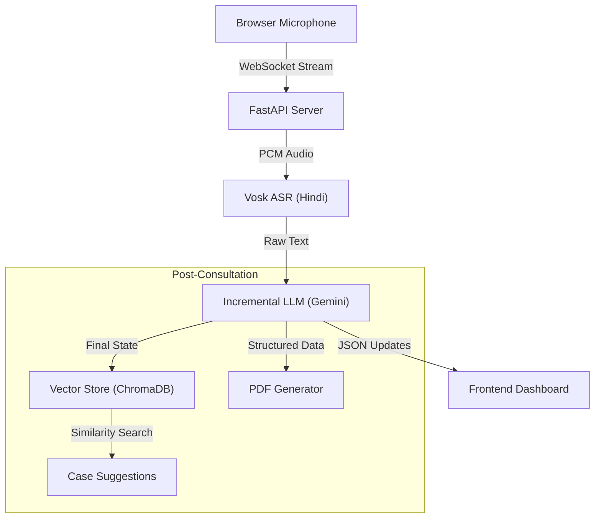

# Hindi Medical Transcription & Clinical Note Assistant

A **real-time Hindi medical transcription system** that converts live doctor–patient conversations into structured clinical data, provides similar case suggestions, and generates a formatted PDF OPD note.

This system is **not a diagnostic tool** and **does not provide medical advice**.
It is a **documentation assistant** designed to reduce manual note-taking and surface relevant historical context.

---

## What This Project Does

- **Real-Time ASR:** Captures live audio and converts Hindi speech to text using Vosk.
- **Live Clinical Structuring:** Incrementally extracts symptoms, medications, and diagnosis *while* the consultation is happening using Gemini.
- **Intelligent Suggestions:** Uses a Vector Database (ChromaDB) to suggest common diagnoses, tests, and medications based on similar past consultations.
- **Hindi PDF Reports:** Generates a professional, Hindi-compatible PDF clinical report for the patient.
- **Audit & Replay:** Stores every session, including raw audio/transcript, for full auditability.

---

## Core Architecture

### High-Level Flow



## Architecture Layers

### 1. Frontend (Browser)

**Files:** `templates/index.html`, `static/app.js`, `static/style.css`

* **Responsibilities:**
* Captures microphone audio (16-bit PCM @ 16 kHz).
* Displays live transcript, structured fields, and suggestions.
* Renders a clean, modern UI with visual feedback for recording states.


* **Design Principle:** Dumb renderer. All logic resides on the backend.

### 2. Transport Layer (WebSocket)

**File:** `app/api/websocket.py`

* **Responsibilities:**
* Manages real-time bi-directional communication.
* Coordinations the ASR stream and LLM updates.
* Handles session finalization and triggers the suggestion engine.


### 3. Speech Recognition (ASR)

**File:** `app/asr/vosk_adapter.py`

* **Technology:** Vosk (`vosk-model-hi-0.22`)
* **Behavior:** Offline, privacy-first speech recognition. Emits partial (low latency) and final results.

### 4. Incremental Structuring (LLM)

**File:** `app/llm/incremental.py`

* **Role:** Updates the clinical state (symptoms, meds, diagnosis) in real-time as the conversation progresses.
* **Model:** Google Gemini (Flash/Pro).
* **Constraints:** Strict JSON schema enforcement; Temperature 0.0 for deterministic output.

### 5. Vector Store & Suggestions

**Files:** `app/vectorstore/chroma_store.py`, `app/vectorstore/suggestions.py`

* **Role:** Embeds finalized consultations into a local ChromaDB.
* **Feature:** When a session ends, it queries the database for similar past cases to suggest likely diagnoses or missed tests based on historical data.

### 6. Storage & Reporting

**File:** `app/storage/session_store.py`

* **Persistence:** Saves raw transcripts, structured JSON, and metadata in a date-partitioned file structure.
* **PDF Generation:** Uses `reportlab` with custom font registration (`NotoSansDevanagari`) to correctly render Hindi characters in the final clinical report.

---

## Features

* **⚡ Real-time Transcription:** Low-latency Hindi speech-to-text.
* **📝 Live Structuring:** Watch the "Symptoms" and "Meds" lists fill up as you speak.
* **💡 Smart Suggestions:** "Based on 5 similar cases, 80% were diagnosed with Viral Fever."
* **📄 Auto-PDF:** One-click generation of a print-ready OPD slip.
* **🛡️ Audit Trail:** Immutable raw transcripts ensure nothing is lost.

---

## Installation

### 1. Clone the repository

```bash
git clone https://github.com/samadrehan02/upgraded-waddle-llm
cd upgraded-waddle-llm
```


### 2. Create and activate virtual environment

```bash
# Windows
python -m venv .venv
.venv\Scripts\activate

# Linux / macOS
python3 -m venv .venv
source .venv/bin/activate

```

### 3. Install dependencies

```bash
pip install -r requirements.txt

```

### 4. Download Vosk Hindi model

Download `vosk-model-hi-0.22` from the [Vosk Models page](https://alphacephei.com/vosk/models) and extract it to:

```
models/vosk/hi/vosk-model-hi-0.22/

```

### 5. Configure environment variables

Create a `.env` file in the root directory:

```env
ENV=dev
GEMINI_API_KEY=your_gemini_api_key_here
GEMINI_MODEL=gemini-2.0-flash-exp  # or gemini-1.5-flash

```

## Running the Application

**Development (Hot Reload):**

```bash
uvicorn main:app --reload

```

**Production:**

```bash
python main.py

```

Access the dashboard at **`http://localhost:8000`**.

---
## How to Test

There are two supported ways to test the system.

### 1. Real-time microphone input

Use a physical microphone and speak naturally.

* Read the script aloud as if you are a real patient.
* This is useful for validating end-to-end, real-world behavior (ASR, timing, pauses, noise).

### 2. Virtual audio cable + generated audio (recommended)

This method is better for:

* Extended testing
* Reproducible runs
* Noisy environments
* Automated or regression testing

You generate a Hindi TTS audio file and route it into the system using a virtual audio cable.

#### Steps

1. Use a virtual audio cable (e.g. VB-Cable).
2. Generate a WAV file using the script below.
3. Set the **Virtual Cable Output** as the microphone input in Chrome.
4. Play the generated audio file.

#### Example: Hindi TTS test script

```bash
import asyncio
import edge_tts
from pydub import AudioSegment
from pathlib import Path

VOICE = "hi-IN-MadhurNeural"
PAUSE_MS = 1000
OUTPUT_WAV = "test_consultation3.wav"

SCRIPT = [
    "मेरा नाम राहुल है",
    "मैं अट्ठाइस साल का हूं",
    "पिछले तीन दिन से तेज बुखार आ रहा है",
    "सिर और आंखों के पीछे बहुत दर्द है",
    "शरीर और जोड़ों में दर्द हो रहा है",
    "उल्टी जैसा लग रहा है और कमजोरी है",
    "आज दोपहर शरीर का तापमान एक सौ दो डिग्री था",
    "ब्लड प्रेशर एक सौ बीस अस्सी है",
    "लक्षण डेंगू से मिलते जुलते लग रहे हैं",
    "प्लेटलेट्स कम होने का खतरा हो सकता है",
    "सीबीसी और प्लेटलेट काउंट कराना होगा",
    "डेंगू एनएस1 एंटीजन टेस्ट करवाइए",
    "अभी ज्यादा तरल पदार्थ लें",
    "दर्द या बुखार के लिए केवल पैरासिटामोल लें",
    "खून की जांच रिपोर्ट आने तक पूरा आराम करें",
]

async def generate_tts():
    segments = []
    silence = AudioSegment.silent(duration=PAUSE_MS)

    for i, sentence in enumerate(SCRIPT):
        tmp_mp3 = Path(f"_seg_{i}.mp3")

        communicate = edge_tts.Communicate(
            text=sentence,
            voice=VOICE,
            rate="+0%",
            volume="+0%",
        )

        await communicate.save(tmp_mp3)

        audio = AudioSegment.from_file(tmp_mp3, format="mp3")
        audio = audio.set_frame_rate(16000).set_channels(1)

        segments.append(audio)
        segments.append(silence)

        tmp_mp3.unlink(missing_ok=True)

    final_audio = sum(segments)
    final_audio.export(
        OUTPUT_WAV,
        format="wav",
        parameters=["-ac", "1", "-ar", "16000"],
    )

    print(f"✅ Generated: {OUTPUT_WAV}")

if __name__ == "__main__":
    asyncio.run(generate_tts())
```
Run this script in a python file, it will save the generated audio in the project root.

In the UI click, start recording, and play the audio.
#### Notes

* Output audio is mono, 16 kHz (speech-model friendly).
* Pauses between sentences simulate natural conversation.
* Using TTS ensures consistent, repeatable test inputs.

---


## Project Structure

```bash
.
├── app/
│   ├── api/          # Endpoints & WebSocket logic
│   ├── asr/          # Vosk adapter
│   ├── llm/          # Gemini integration & incremental parsing
│   ├── pipeline/     # Schema normalization
│   ├── storage/      # File I/O and PDF generation
│   └── vectorstore/  # ChromaDB & Suggestion engine
├── models/           # Local ML models (Vosk)
├── static/           # CSS, JS, and Fonts
├── templates/        # HTML
├── data/             # Session storage (created at runtime)
├── main.py           # Entry point
└── requirements.txt

```

## Status

This project is a functional proof-of-concept. It demonstrates a complete pipeline from audio ingestion to vector-backed clinical insights, suitable for further hardening and integration into hospital workflows.
